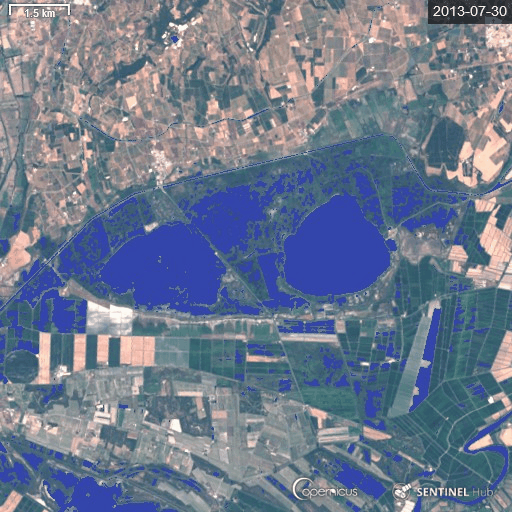

# Water in Wetland - WIW

---

<a href="#" id='togglescript'>Show</a> script or [download](wiw_L8_script.js)

## Evaluate and visualize
 - [Sentinel Playground](https://apps.sentinel-hub.com/sentinel-playground/?source=S2&lat=43.528275786844155&lng=4.411229195538908&zoom=11&preset=CUSTOM&layers=B01,B02,B03&maxcc=0&gain=1.0&gamma=1.0&time=2018-08-01%7C2019-02-27&atmFilter=&showDates=false&evalscript=Ly8KLy8gRGV0ZWN0aW5nIHRoZSBQcmVzZW5jZSBvZiBXYXRlciBpbiBXZXRsYW5kcyB3aXRoIExhbmRzYXQtOCBTYXRlbGxpdGUgKGFiYnJ2LiBXSVcpCi8vCi8vIEdlbmVyYWwgZm9ybXVsYTogSUYgQjA1PDAuMTczNSBBTkQgQjA3PDAuMTAzNSBUSEVOIFdhdGVyIEVMU0UgTm9XYXRlcgovLwovLyBVUkwgaHR0cHM6Ly93d3cuaW5kZXhkYXRhYmFzZS5kZS9kYi94eHh4eHh4eHh4eHh4eHh4eHh4eHh4eHh4eHh4eHh4Ly8KCgpyZXR1cm4gQjA1PDAuMTczNSYmQjA3PDAuMTAzNT9bNTEvMjU1LDY4LzI1NSwxNzAvMjU1XTpbQjA0KjUsQjAzKjUsQjAyKjVdIAoKLy8gY29sb3JCbGVuZCB3aWxsIHJldHVybiBhIGJsdWUgY29sb3Igd2hlbiBzdXJmYWNlIHdhdGVyIGlzIGRldGVjdGVkLCBhbmQgbGlnaHRlbiB0byBhIG5hdHVyYWwgY29sb3Igd2hlbiBubyB3YXRlciBpcyBkZXRlY3RlZAo%3D)
 - [EO Browser](https://apps.sentinel-hub.com/eo-browser/?lat=43.5077&lng=4.5772&zoom=12&time=2019-12-06&preset=CUSTOM&datasource=Landsat%208%20USGS&layers=B02,B03,B04&evalscript=Ly8gRGV0ZWN0aW5nIHRoZSBQcmVzZW5jZSBvZiBXYXRlciBpbiBXZXRsYW5kcyB3aXRoIExhbmRzYXQtOCBTYXRlbGxpdGUgKGFiYnJ2LiBXSVcpCi8vCi8vIEdlbmVyYWwgZm9ybXVsYTogSUYgQjA1PDAuMTczNSBBTkQgQjA3PDAuMTAzNSBUSEVOIFdhdGVyIEVMU0UgTm9XYXRlcgovLwovLyBVUkwgaHR0cHM6Ly93d3cuaW5kZXhkYXRhYmFzZS5kZS9kYi94eHh4eHh4eHh4eHh4eHh4eHh4eHh4eHh4eHh4eHh4Ly8KCnJldHVybiBCMDU8MC4xNzM1JiZCMDc8MC4xMDM1P1s1MS8yNTUsNjgvMjU1LDE3MC8yNTVdOltCMDQqNSxCMDMqNSxCMDIqNV07CgovLyBjb2xvckJsZW5kIHdpbGwgcmV0dXJuIGEgYmx1ZSBjb2xvciB3aGVuIHN1cmZhY2Ugd2F0ZXIgaXMgZGV0ZWN0ZWQsIGFuZCBsaWdodGVuIHRvIGEgbmF0dXJhbCBjb2xvciB3aGVuIG5vIHdhdGVyIGlzIGRldGVjdGVk&evalscripturl=https://raw.githubusercontent.com/Tourduvalat/custom-scripts/master/landsat-8/WIW/wiw_L8_script.js)   

## Basic information
 - Spectral bands used for water detection :  B5, B7
 - Spectral Bands used for back ground display : B2, B3, B4

## General description of the script
The WIW script generates water maps using the Water In Wetlands logical rule by featuring water in blue and other landscape features in natural colors.  The maps include open-water areas, as well as water under dense vegetation cover. Use of the WIW script in combination of the timelape tool provides a dynamic representation of inundation patterns, which are useful for assessing wetland extent and functions. 

## Description of representative images
WIW timelapse at the largest reed marsh in southern France from July 2013 through June 2014 (monthly interval).

## References
 Lefebvre G., Davranche A., Willm L., Campagna J., Redmond L., Merle C., Guelmami A., Poulin B. 2019. Introducing WIW for Detecting the Presence of Water in Wetlands with Landsat and Sentinel Satellites. Remote Sensing 11(19):18. [DOI : https://doi.org/10.3390/rs11192210](https://www.mdpi.com/2072-4292/11/19/2210/)

Sentinel Online [Copernicus Sentinel-2 helps track changes in seasonal water of wetlands](https://sentinels.copernicus.eu/web/sentinel/news/-/article/copernicus-sentinel-2-helps-track-changes-in-seasonal-water-of-wetlands)

