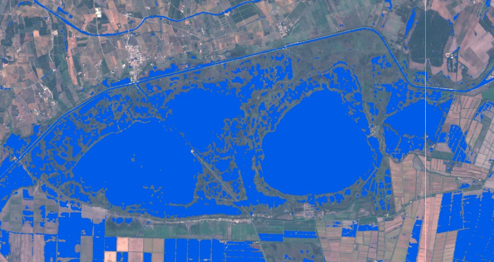

# Water in Wetland - WIW

---

<a href="#" id='togglescript'>Show</a> script or [download](script.js){:target="_blank"} it.


      


## Evaluate and visualize
 - [Sentinel Playground](https://apps.sentinel-hub.com/sentinel-playground/?source=S2&lat=43.5077&lng=4.5772&zoom=12&time=2019-12-06&evalscripturl=https://raw.githubusercontent.com/Tourduvalat/custom-scripts/master/sentinel-2/WIW/script.js){:target="_blank"}    
 - [EO Browser](https://apps.sentinel-hub.com/eo-browser/?lat=43.5077&lng=4.5772&zoom=12&time=2019-12-06&preset=CUSTOM&datasource=Sentinel-2%20L1C&layers=B02,B03,B04&evalscript=Ly8KLy8gRGV0ZWN0aW5nIHRoZSBQcmVzZW5jZSBvZiBXYXRlciBpbiBXZXRsYW5kcyB3aXRoIFNlbnRpbmVsLTIgU2F0ZWxsaXRlIChhYmJydi4gV0lXKQovLwovLyBHZW5lcmFsIGZvcm11bGE6IElGIEI4QTwwLjE4MDQgQU5EIEIxMjwwLjExMzEgVEhFTiBXYXRlciBFTFNFIE5vV2F0ZXIKLy8KLy8gVVJMIGh0dHBzOi8vd3d3LmluZGV4ZGF0YWJhc2UuZGUvZGIveHh4eHh4eHh4eHh4eHh4eHh4eHh4eHh4eHh4eHh4eC8vCgoKcmV0dXJuIEI4QTwwLjE4MDQmJkIxMjwwLjExMzE%2FWzUxLzI1NSw2OC8yNTUsMTcwLzI1NV06W0IwNCo1LEIwMyo1LEIwMio1XQoKLy8gcmV0dXJuIGEgYmx1ZSBjb2xvciB3aGVuIHdhdGVyIGlzIGRldGVjdGVkIGluIHdldGxhbmRzLgovLyBXaGVuIG5vIHdhdGVyLCByZXR1cm4gbGlnaHRlbiB0cnVlIGNvbG9yIGNvbXBvc2l0aW9uCgovLyBGYWxzZSBkZXRlY3Rpb24gcHJvYmxlbXMgOiBvbiA%3D&evalscripturl=https://raw.githubusercontent.com/Tourduvalat/custom-scripts/master/sentinel-2/WIW/script.js){:target="_blank"}   

## Basic information
 - Bands used for water detection :  B8a B12
 - Bands used for back ground display : B2, B3, B4

## General description of the script
The WIW script generates water maps using the Water In Wetlands logical rule by featuring water in blue and other landscape features in natural colors.  The maps include open-water areas, as well as water under dense vegetation cover. Use of the WIW script in combination of the timelaps tool provides a dynamic representation of inundation patterns, which are useful for assessing wetland extent and functions. 

## Description of representative images
Charnier-Scamandre marshes, South of France  10/15/2018.

## References
 Lefebvre G., Davranche A., Willm L., Campagna J., Redmond L., Merle C., Guelmami A., Poulin B. 2019. Introducing WIW for Detecting the Presence of Water in Wetlands with Landsat and Sentinel Satellites. Remote Sensing 11(19):18. [DOI : https://doi.org/10.3390/rs11192210](https://www.mdpi.com/2072-4292/11/19/2210/)

Sentinel Online [Copernicus Sentinel-2 helps track changes in seasonal water of wetlands](https://sentinels.copernicus.eu/web/sentinel/news/-/article/copernicus-sentinel-2-helps-track-changes-in-seasonal-water-of-wetlands)

